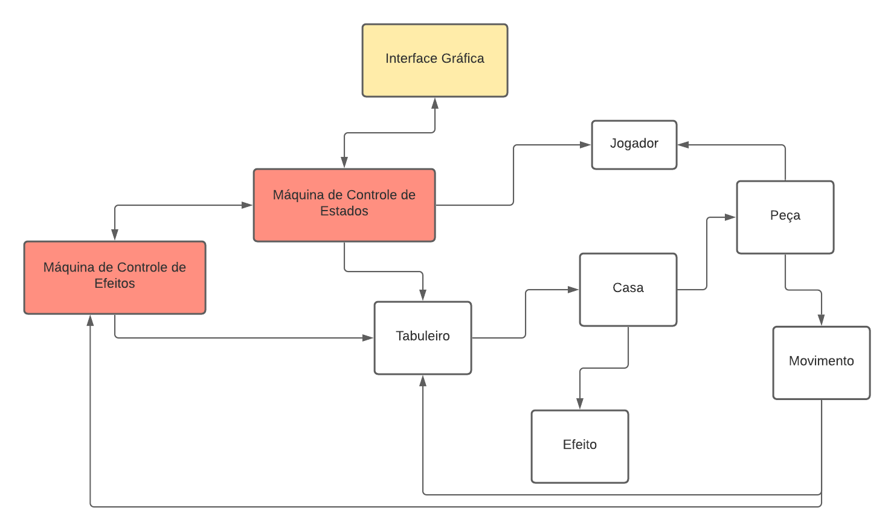

# Projeto <Título>
Versão em construção do trabalho final de MC322, na UNICAMP.  
O código do projeto desenvolvido até então pode ser encontrado em [src/mc322/lab07](./src/mc322/lab07).

## Descrição
Uma partida de xadrez não é mais apenas uma batalha entre peças brancas e peças pretas, agora é uma batalha entre nações.
Cada nação tem habilidades especiais que mudam drasticamente o fluxo da partida. Você não precisa se preocupar com o próximo movimento de uma peça se ela estiver congelada!

## Equipe
* Igor Henrique Buranello dos Santos - RA 171953
* Wallace Gustavo Santos Lima - RA 195512

## Vídeos do Projeto
### 

## Slides do Projeto
### 

colocar slides

## Documentação dos Componentes
## Diagramas
### Diagrama Geral do Projeto
  
* A **Interface Gráfica** deve fazer a ponte entre os usuários e o jogo em si. Ela recebe comandos (por meio de cliques com o *mouse*) e os comunica para a **Máquina de Estados**.    
* A **Máquina de Estados** é a responsável pela orquestração máxima do jogo: ela recebe da **Interface Gráfica** os comandos do usuário, administra os estados de jogo (*Carregamento, Início de Jogo, Início de turno, Seleção de Peça, Seleção de Habilidade, Seleção de Destino, Execução de Movimento, Fim de Turno e Fim de jogo*) e informa as configurações dos demais componentes durante o jogo.    
* A **Máquina de Efeitos** recebe informações de uso de habilidades pelos jogadores e as configura no **Tabuleiro** e retorna informações sobre as habilidades que estão ativadas no momento.      
* O **Jogador** representa um dos usuários do Jogo e contém informações relevantes como a Pontuação, a Nação ao qual ele pertence e as Habilidades que podem ser usadas.    
* O **Tabuleiro** modela a plataforma de Xadrez e faz a comunicação com as **Casas**.    
* Cada **Casa** modela uma casa da plataforma de xadrez e possui informações como a **Peça** que está sobre ela e o **Efeito** ao qual ela está submetida.  
* A **Peça** modela as peças do jogo de xadrez e possui instâncias de **Movimento**, o qual controla os movimentos das peças.    
* Por fim, **Efeito** é um modelo dos efeitos de habilidades do jogo.
